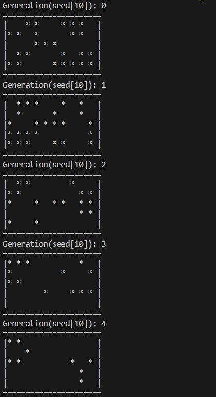

# Game of Life

### Introduction
The universe of the Game of Life is an infinite two-dimensional orthogonal grid of square cells, each of 
which is in one of two possible states, alive or dead. Every cell interacts with its eight neighbors, which 
are the cells that are horizontally, vertically, or diagonally adjacent.

### Rules
The universe of the Game of Life is an infinite two-dimensional orthogonal grid of square cells, each of 
which is in one of two possible states, alive or dead. Every cell interacts with its eight neighbors, which 
are the cells that are horizontally, vertically, or diagonally adjacent. 

### Execution
The program runs infinitely or till there are no living cells in the world.
To stop, press `Ctrl` + `c`

#### Prerequisites
- Please ensure that the appropriate [go version](https://go.dev/doc/install) is installed for your system. At least go1.18 is recommended.
#### Commands
- The program can be executed directly with go
```bash
    go run ./...
```
- options in the form of flags are provided. These can be viewed using
```bash
    go run ./... --help
```
- following command line flags can be passed
```bash
  -columns int
        number of columns (default 40)
  -file string
        current save state of the world
  -rows int
        number of rows (default 40)
  -seed int
        starting seed
```
#### Loading world from a file
[Sample file](./docs/blinker.txt)
```bash
    go run ./... --file <path_to_file>
```
### Sample Run
```bash
    go run ./... --seed 10 --rows 5 --columns 10
```
